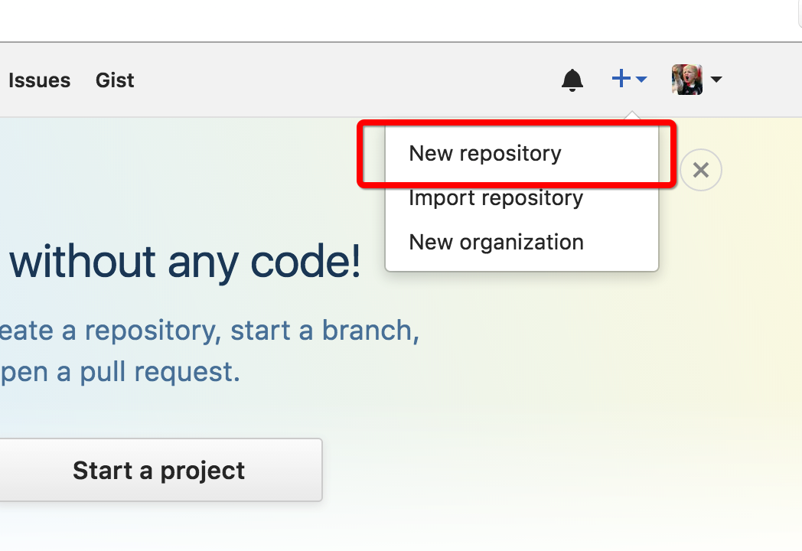
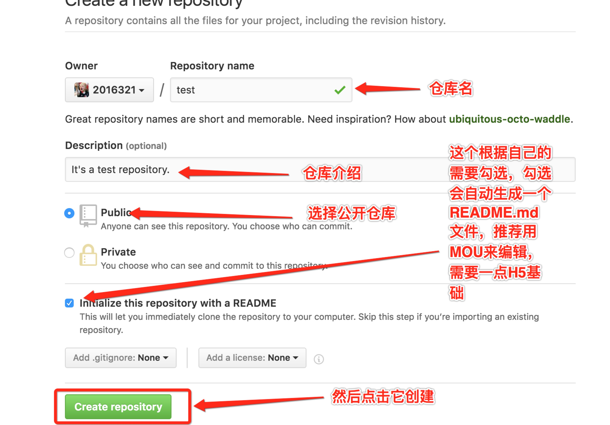
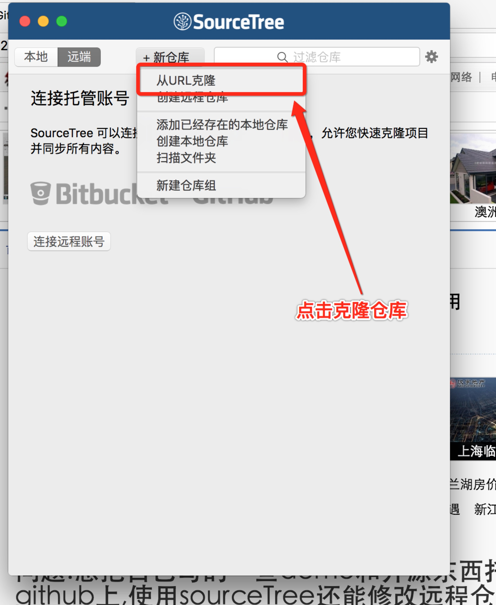
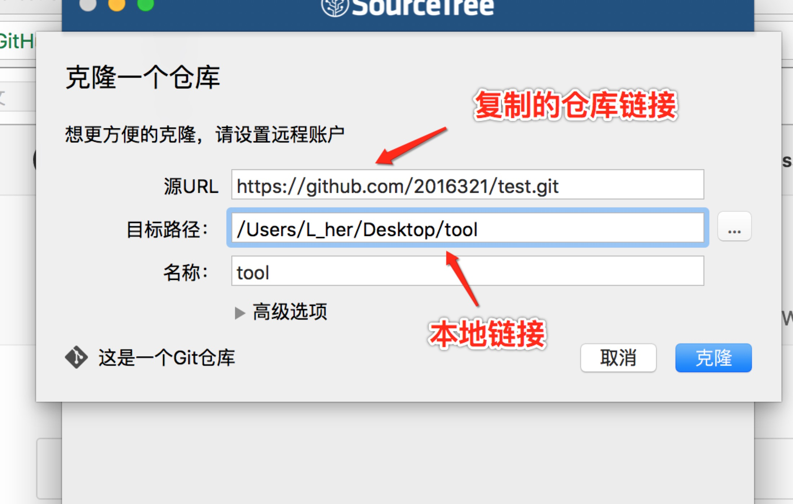
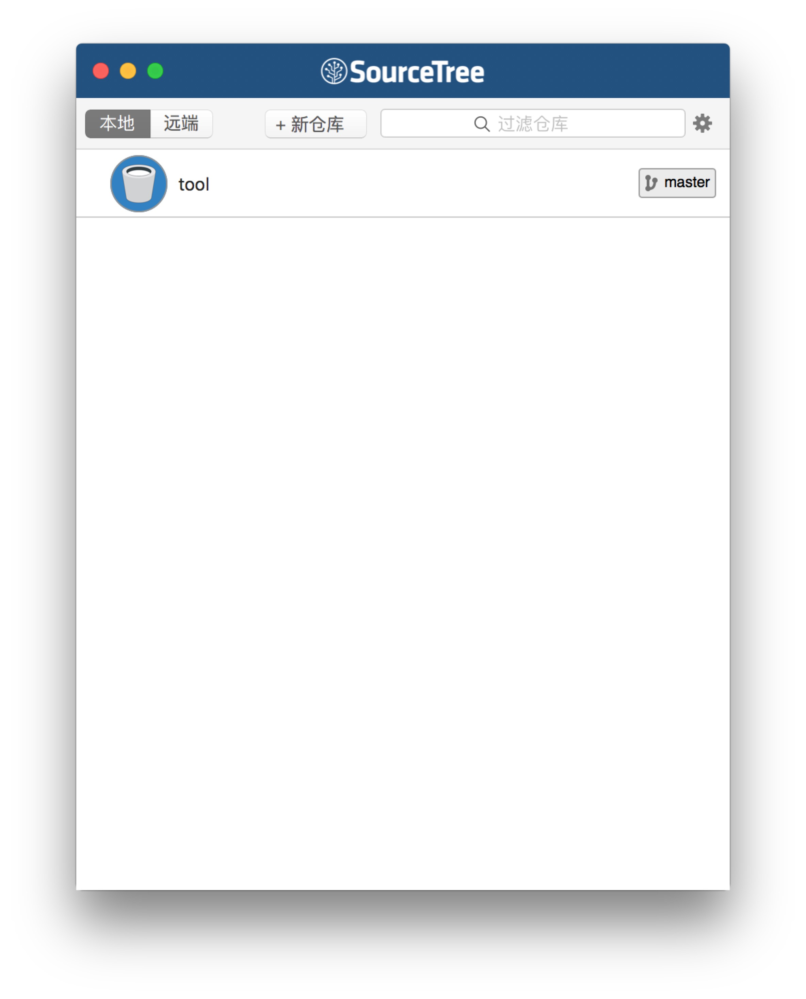
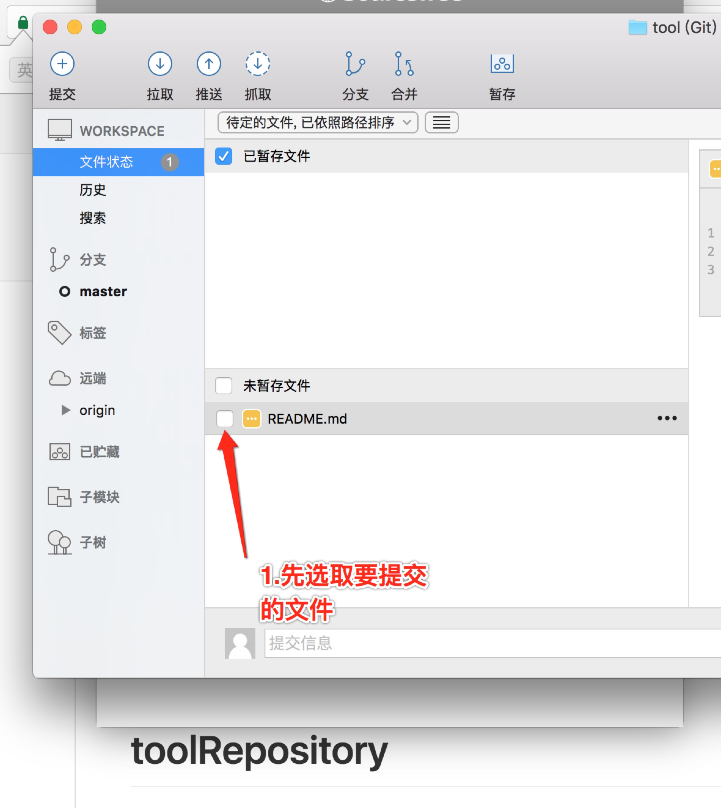
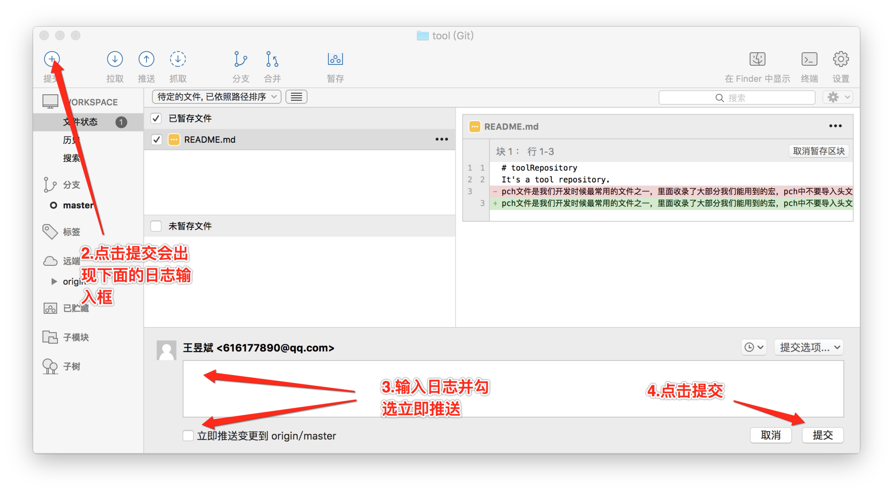

# Mac上提交GIT代码
作为一个年轻的程序员，一直在github上索取，该是时候回报一下社会了，虽然我们的力量微乎其微，但是上传代码也是一个很好的积累过程。鉴于很多小伙伴对代码上传带github上面有很多疑惑，我就简单描述一下上传的流程。
ps：仅限于Mac，win版之后会更新
## 申请github账号
我想这个就不用多说了，
<a href="https://github.com/join?source=header-hom">注册github 我也只能帮到这了</a>
## 下载sourcetree
下载<a href="https://www.sourcetreeapp.com/download">sourcetree</a>
## 连接github创建仓库
#### 点击这个按钮

#### 然后创建仓库

#### 点击复制仓库地址

#### 安装
安装的过程比较简单，添加账号时候可以用Google账号，登陆时候需要git账号密码
#### 克隆仓库

#### 输入地址，点击克隆

这时候本地选项中就会出现对应的仓库

#### 提交修改

#### 最后刷新一下自己的git主页面就会发现自己的公开仓库
因为自己也是小白，所以如果有描述不周的地方还请见谅，希望能给大家带来帮助